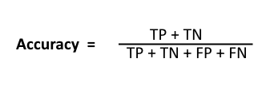

# Machine Learning Engineer Nanodegree

## Capstone Proposal

Arnesh Sahay  
July 4th, 2020

## Proposal

### Domain Background

Neural networks are excellent tools when trying to solve image classification problems. Image classification can span a multitude of areas, from multi-class classification problems like determining the make and model of a car to binary classification problems like identifying fire hydrants in images. One such image classification problem is identifying dog breeds. This is a problem at which a lot of humans, like myself, are not particularly adept, but a neural network can be trained to recognize different breeds in a matter of minutes given a sufficient training set and the necessary infrastructure.

For this project, a [Convolutional Neural Network (CNN)](https://en.wikipedia.org/wiki/Convolutional_neural_network) will be trained to identify images of dogs and determine the appropriate breed of the canine. A CNN looks at images through a filter that convolves across the receptive field, similar to how humans read sentences one word at a time.

> Nal Kalchbrenner, Edward Grefenstette, and Phil Blunsom. [A Convolutional Neural Network for Modelling Sentences](https://www.cs.ox.ac.uk/publications/publication8536-abstract.html). In _Proceedings of ACL_, 2014.

Afterwards, a feature map is built for the image and it can be used to determine the appropriate category for image classification. Over the course of training, the model will start to learn which features correspond to which dog breeds and can start making predictions on new images.

### Problem Statement

There are two components to the model in this project. The first is a binary classification task that will consist of determining whether an image is of a human or a dog. The second is a multi-class classification task - if the image is of a dog, the model will need to identify the breed to which it belongs; otherwise, if the image is of a human, the model will need to determine the breed that the human most closely resembles. The binary classification step will detect if a dog is present in the image and output `true` if a dog is detected or `false` otherwise. Afterwards, multi-class classification will match the image to a particular breed out of 133 possibilities.

### Datasets and Inputs

There are two datasets for this project to be used for this project - [dogImages](https://s3-us-west-1.amazonaws.com/udacity-aind/dog-project/dogImages.zip), which contains images of dogs categorized by breed, and [lfw](https://s3-us-west-1.amazonaws.com/udacity-aind/dog-project/lfw.zip), which contains images of humans. The dog images dataset has 8,351 total images split into 133 breeds, or categories, of dogs. The data is further broken down into 6,680 images for training, 835 images for validation, and 836 images for testing. The human images dataset has 13,233 total images across 5,749 people.

[OpenCV's implementation of Haar feature-based cascade classifiers](https://opencv-python-tutroals.readthedocs.io/en/latest/py_tutorials/py_objdetect/py_face_detection/py_face_detection.html) will be used to detect human faces in the `face_detector` function, and [a pre-trained ResNet-50 model](https://ethereon.github.io/netscope/#/gist/db945b393d40bfa26006) will be used to detect dogs in images in the `dog_detector` function. 100 images from each the human and dog sets will be used to test both functions, after which the CNN will be trained, validated, and tested using the `dogImages` dataset.

### Solution Statement

Given an image of a dog or human, the CNN should be able to output the breed of the dog or the breed that matches most closely the human likeness. In order to measure the performance of the solution, it will make the most sense to provide the model with a series of dog images and measure its accuracy. An accuracy of greater than 60% should be acceptable for the purposes of this project.

### Benchmark Model

The [pre-trained VGG-16 model](https://pytorch.org/docs/master/torchvision/models.html) to identify dog breeds can be used as a benchmark model. It currently classifies dog breeds from a test set with an accuracy of roughly 40%, which is below the success criteria defined for this project. The goal of this project is to create a CNN that out-performs this model and delivers an accuracy of greater than 60%.

### Evaluation Metrics

Using a test set from the `dogImages` dataset, it is possible to measure accuracy by counting `true positives` identified by the model and weighing them against the total number of predictions made. This calculation is outlined below.

### Project Design

The end-to-end functionality of this project will employ a multitude of separate components. Any input would first be run through the `face_detector` and `dog_detector` functions to determine if the image is of a person or dog. Afterwards, the image would be fed into a CNN to determine the appropriate breed to which the image should belong.

The machine learning pipeline will include:

1. Importing the datasets
2. Binary classification
    * a. Detecting humans
    * b. Detecting dogs
3. Convolutional Neural Network (CNN)
    * a. Classifying dog breeds from scratch
    * b. Classifying dog breeds using transfer learning
4. Algorithm implementation for images provided as input
5. Model performance testing

The `face_detector` function will leverage [OpenCV's implementation of Haar feature-based cascade classifiers](https://opencv-python-tutroals.readthedocs.io/en/latest/py_tutorials/py_objdetect/py_face_detection/py_face_detection.html) to detect human faces in images. The `dog_detector` function will utilize [a pre-trained ResNet-50 model](https://ethereon.github.io/netscope/#/gist/db945b393d40bfa26006) to detect dogs in images. The CCN will use transfer learning and extract bottleneck features from one of the following different pre-trained models available in Keras:
    * VGG-19 bottleneck features
    * ResNet-50 bottleneck features
    * Inception bottleneck features
    * Xception bottleneck features

To better describe the function of the CNN in this project, the illustration below shows an example of how CNNs handle image classification. The convolutional and max-pooling layers extract features from a provided input image. Those features are then used to perform non-linear transformations in the fully-connected layer and produce a classification result.

